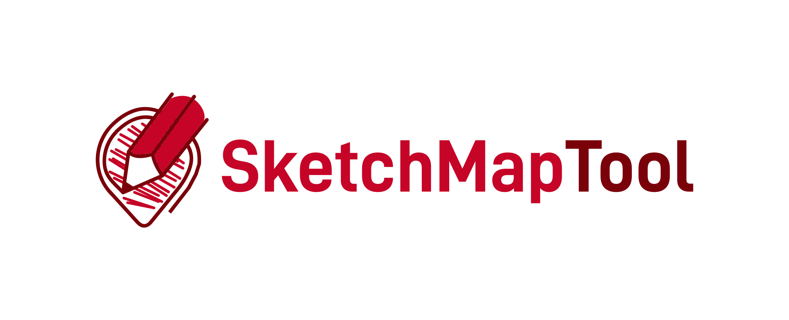

# Sketch Map Tool

The Sketch Map Tool is an easy-to-use tool for participatory sketch mapping through offline collection, digitization and georeferencing of local spatial knowledge.

The tool has a variety of applications. For example, do you want to work together with people in a community to map their experience and perception of risk in their neighbourhood in a paper-based format, but still be able to quickly analyse the results digitally? Then, the Sketch Map Tool is exactly what you need!

## Contributing Guideline

Please refer to [this document](/CONTRIBUTING.md).

## Development Setup

Please refer to the [development setup documentation](/docs/development-setup.md).

## Components

## Funding

The initial proof of concept has been developed in the project T2S Waterproofing Data which is financially supported by the Belmont Forum
and NORFACE Joint Research Programme on Transformations to Sustainability, co-funded by DLR/BMBF (Federal Ministry of
Education and Research) as part of its Social-Ecological Research funding priority, ESRC/Global Challenges Research
Fund (ES/S006982/1), FAPESP and the European Commission through Horizon 2020. Additional work on the Sketch Map Tool has
been financially supported by the German Red Cross. The ongoing work takes place at [HeiGIT](https://heigit.org).
