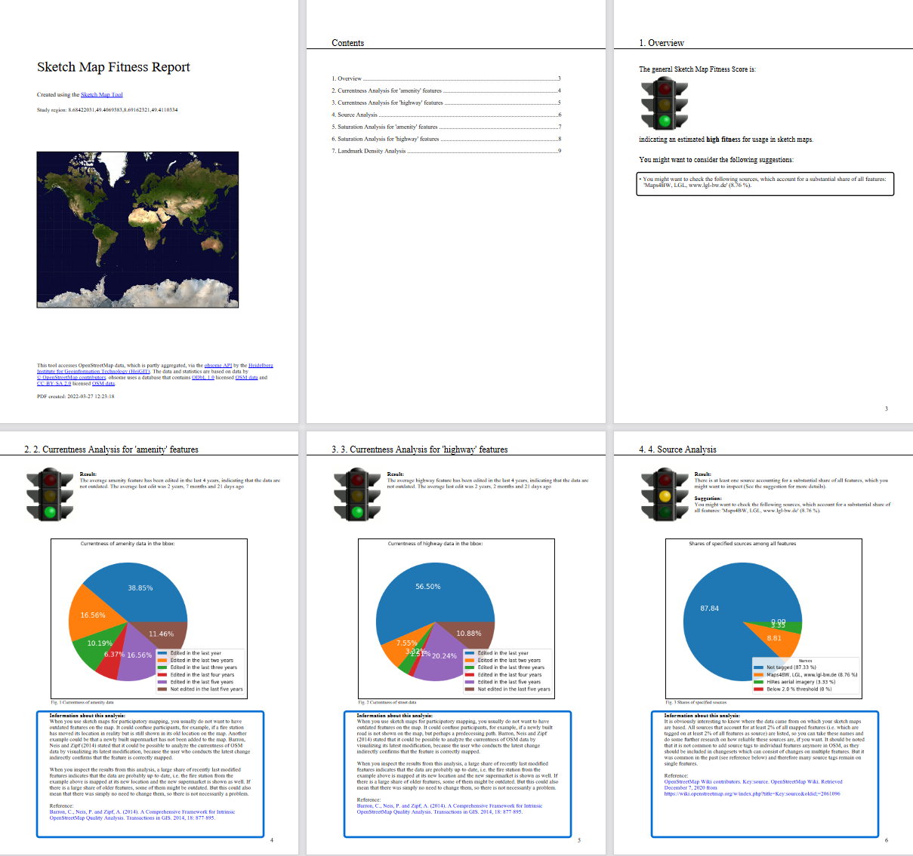
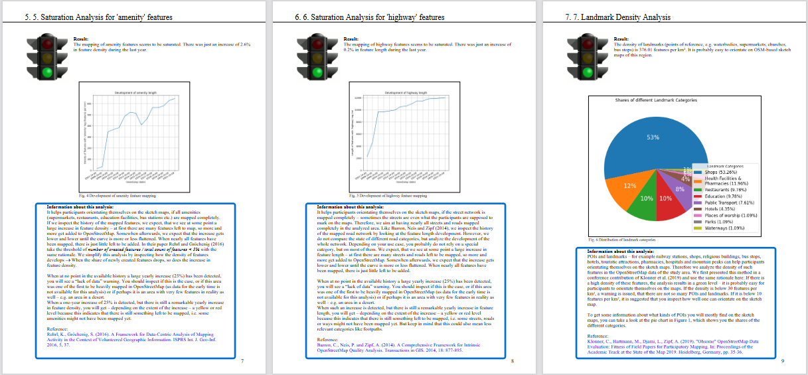

# Sketch Map Fitness Analyses

Collection of analyses to check the fitness of a region's OSM data for use in sketch maps as well as html and pdf output
generators.

The structure is as follows:
* [run_analyses.py](run_analyses.py) contains the function  
    ```
    run(bboxes_input: List[Bbox], output_path: str) -> Dict[str, str]
    ```
    which starts both all analyses and the output generation for the given bounding boxes and returns a dict to build
    hyperlinks with the texts as keys and the URLs as values to the status pages showing the analyses' progress
* [modules](modules) contains the abstract class `Analysis`, which is the super class of all analyses, as well as all 
    analyses classes
* [html_gen](html_gen) contains the module `analyses_output_generator`, which is used to create HTML pages presenting
    the analyses' results
* [pdf_gen](pdf_gen) contains the module `pdf_gen`, which is used to create a PDF report presenting
    the analyses' results
* [helpers.py](helpers.py) contains useful functions and classes for dealing with the analyses and their results,
    especially the classes `QualityLevel`, the instances of which indicate the sketch map fitness level with a traffic
    light system (*red = potentially problematic* to *green = good*), and `AnalysisResult`, the instances of which
    contain the results to one analysis each

More detailed information can be obtained from the code comments. The results look like these:
### HTML output


### PDF output

