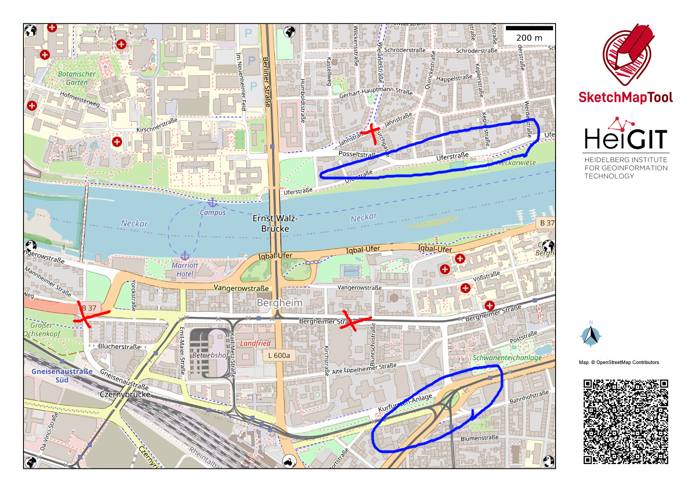
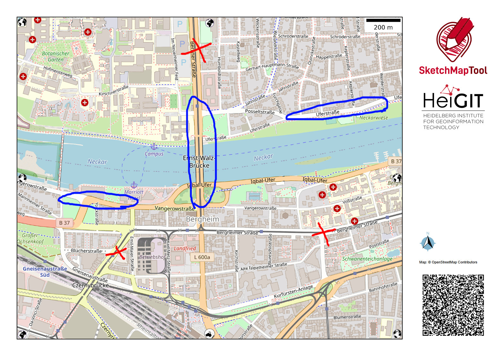
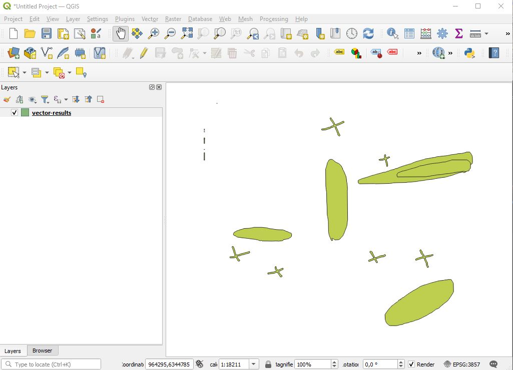
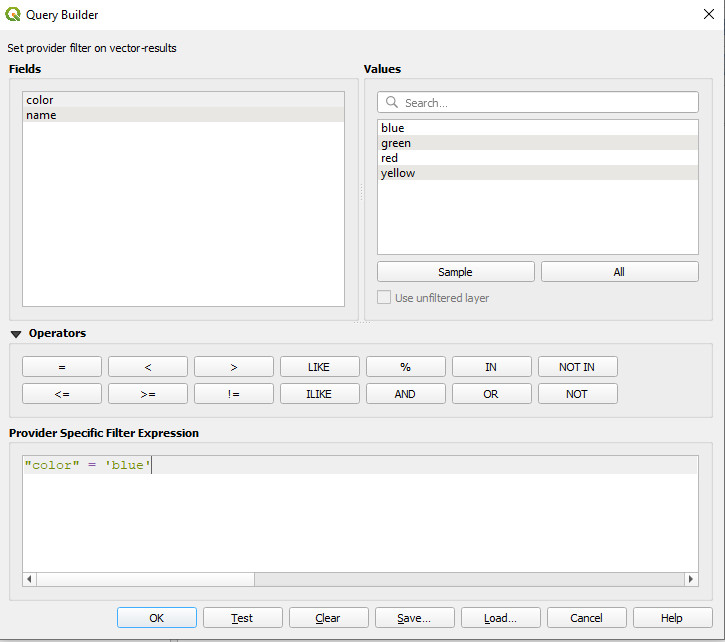

# How to filter Sketch Map Tool results in QGIS

We have uploaded two sketch maps together, both containing markings in blue and red. To 
avoid that users have to handle a lot of files in case of simultaneously uploaded sketch 
maps and sketch maps with markings in different colours, the Sketch Map Tool only provides 
a single output file (GeoJSON) for the vector data.

The marked sketch maps that have been uploaded look as follows:  



We want to use [QGIS](https://www.qgis.org/) to inspect the results for different sketch 
maps and different colours separately.

## 1. Import results
* Open QGIS and start a new project (`Project` -> `New`)
* Create a new vector layer (`Layer` -> `Add Layer` -> `Add Vector Layer`)
* Select under `Source` the GeoJSON (`vector-results.geojson`) you downloaded from the Sketch Map Tool
* Click on `Add` to add the new vector layer to your project

Our project now looks like this, we see all markings:  


## 2. Filter by colour
Now we want to either see only red or blue markings.
* Right-Click on the layer in the layer view on the left (`vector-results`) and click on `Filter`
* Either paste the following filter expression directly in the field `Provider Specific Filter Expression`:
  ```
  "color" = 'blue'
  ```
  for all blue markings or
  ```
  "color" = 'red'
  ```
  for all red markings.
* Or: Build the filter expression by first double-clicking on `color` under `Fields`, then clicking on `=` under 
  `Operators`, and then after selecting `color` under `Fields` and clicking on `All` under `Values` double-clicking on
  `red` or `blue`, depending on which colour you want to select. Now the field under `Provider Specific Filter Expression`
  should contain the same expression as above.
* Then click `OK` to apply the filter.

Before clicking `OK`, the query builder looks like this:


After applying the filter for blue markings, our project looks as follows:


## 3. Filter by sketch map
...

## 4. Filter by colour and sketch map
...

## 5. Export filtered layer
...